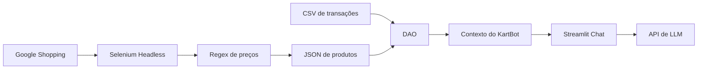

# KartBot

KartBot é um agente financeiro com IA Generativa criado para apoiar o controle orçamentário no automobilismo amador e profissional. A solução transforma preços de mercado e histórico de gastos em uma interface de chat capaz de responder perguntas sobre custos de etapa, pneus, inscrições, manutenção e itens recorrentes de uma operação de kart.

O diferencial estratégico do KartBot está em aproximar a disciplina financeira de uma equipe profissional da realidade de pilotos e equipes que precisam decidir rápido, controlar caixa e reduzir surpresas antes de cada prova.

## Visão Geral

No kart, pequenos desvios de orçamento podem comprometer treino, manutenção ou participação em etapas. O KartBot centraliza dados de produtos e despesas para responder com base em evidência, não em estimativa informal.

A aplicação usa:

- automação de coleta de dados com Selenium e Regex;
- camada de abstração de dados no padrão DAO;
- interface interativa com Streamlit;
- integração com API de LLM usando contexto financeiro local.

## Arquitetura



### Camadas Técnicas

| Camada | Arquivo | Função |
|--------|---------|--------|
| Scraping | `src/google_shopping_scraper.py` | Busca itens no Google Shopping, coleta textos dos resultados e calcula preços médios |
| Dados | `src/dao.py` | Implementa `ProdutoDAO` e `TransacaoDAO` para leitura tipada de JSON e CSV |
| Aplicação | `src/app.py` | Cria a interface de chat em Streamlit e envia contexto para a LLM |
| Mercado | `data/produtos_financeiros.json` | Armazena produtos monitorados e preços médios |
| Histórico | `data/transacoes.csv` | Armazena entradas e saídas do piloto ou equipe |

## Funcionalidades

- Coleta automatizada de preços no Google Shopping.
- Extração de valores monetários com Regex.
- Conversão de preços para `float` e cálculo de média por produto.
- Leitura modular dos dados com padrão DAO.
- Consulta de gastos mensais e histórico de manutenção.
- Chat em Streamlit com contexto financeiro do kart.
- Regra específica para custo de etapa: média de um jogo de pneus novo mais despesas de inscrição presentes no CSV.

## Estrutura do Projeto

```text
KartBot/
├── data/
│   ├── produtos_financeiros.json
│   └── transacoes.csv
├── docs/
│   └── 01-documentacao-agente.md
├── src/
│   ├── app.py
│   ├── dao.py
│   └── google_shopping_scraper.py
├── requirements.txt
└── README.md
```

## Como Executar

Instale as dependências:

```powershell
pip install -r requirements.txt
```

Atualize os preços de mercado:

```powershell
python src\google_shopping_scraper.py
```

Configure a chave da API de LLM:

```powershell
$env:OPENAI_API_KEY="sua_chave"
```

Execute a interface:

```powershell
streamlit run src\app.py
```

## Configuração da LLM

Por padrão, a aplicação usa uma API compatível com Chat Completions:

- `OPENAI_API_KEY` ou `LLM_API_KEY`: chave de autenticação;
- `LLM_API_URL`: endpoint da API, com padrão `https://api.openai.com/v1/chat/completions`;
- `LLM_MODEL`: modelo usado, com padrão `gpt-4o-mini`.

## Prompt do Agente

```text
Você é o KartBot, um consultor financeiro de equipes de kart. Use APENAS os preços médios do JSON e o histórico do CSV fornecidos. Se questionado sobre o custo de uma etapa, some a média de um jogo de pneus novo com as despesas de inscrição presentes no CSV.
```

## Valor Estratégico

O KartBot ajuda equipes a transformar dados operacionais em decisões financeiras mais rápidas e rastreáveis. Para pilotos amadores, isso significa clareza sobre o custo real de competir. Para equipes profissionais, significa padronização de análise, menos retrabalho e uma base mais consistente para planejamento de temporada.

Com uma arquitetura simples e extensível, o projeto pode evoluir para incluir novas fontes de preços, dashboards de orçamento, alertas de variação de custo e integração com sistemas internos de gestão de equipe.
