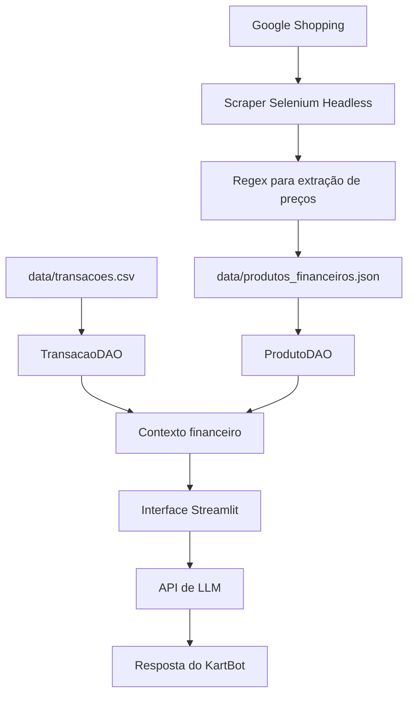

# Documentação do Agente KartBot

## Caso de Uso

### Problema

Equipes de kart amador e profissional precisam tomar decisões rápidas sobre orçamento, manutenção, pneus, inscrições e reposição de peças. Na prática, esses custos ficam espalhados entre planilhas, históricos de pagamento, conversas e cotações manuais, o que dificulta prever o custo real de uma etapa ou comparar o impacto financeiro de uma compra.

O KartBot resolve esse problema ao transformar dados de mercado e histórico financeiro em uma base consultiva acessível por chat.

### Solução

O KartBot é um consultor financeiro especializado em equipes de kart. Ele combina preços médios coletados no Google Shopping com o histórico de transações do piloto ou da equipe para responder perguntas sobre custos operacionais, planejamento de etapa e controle orçamentário.

A solução foi desenhada para apoiar decisões como:

- estimar o custo de uma etapa;
- comparar produtos monitorados, como capacetes, viseiras, pneus e acessórios;
- consultar gastos mensais registrados;
- identificar despesas de manutenção;
- reduzir decisões baseadas em achismo ou cotações desatualizadas.

### Público-Alvo

O agente atende pilotos independentes, chefes de equipe, preparadores, escolas de kart e organizações que operam com orçamento limitado e precisam controlar custos com mais previsibilidade.

No kart amador, o diferencial está em profissionalizar o controle financeiro. No kart profissional, o valor está em acelerar análise de custo e apoiar decisões recorrentes de operação.

## Persona e Tom de Voz

### Nome do Agente

KartBot

### Personalidade

O KartBot se comporta como um consultor financeiro técnico, objetivo e pragmático. Ele evita respostas genéricas e concentra suas recomendações nos dados disponíveis no projeto.

### Tom de Comunicação

O tom é direto, claro e orientado a decisão. O agente explica cálculos quando necessário, mas prioriza respostas úteis para quem precisa decidir rapidamente quanto gastar, onde cortar custo ou qual item pesa mais no orçamento.

### Exemplos de Linguagem

- Saudação: "Olá, sou o KartBot. Posso ajudar a analisar custos usando os dados financeiros do projeto."
- Confirmação: "Vou calcular com base nos preços médios do JSON e nas transações do CSV."
- Limitação: "Não encontrei essa informação na base fornecida. Posso responder apenas com os dados disponíveis no JSON e no CSV."

## Arquitetura Técnica

O KartBot foi estruturado em camadas para manter separação de responsabilidades, facilitar manutenção e reduzir acoplamento entre coleta, leitura de dados e interface conversacional.



### Componentes

| Componente | Arquivo | Responsabilidade |
|------------|---------|------------------|
| Coleta automatizada | `src/google_shopping_scraper.py` | Buscar produtos no Google Shopping com Selenium em modo headless |
| Extração de preços | `src/google_shopping_scraper.py` | Usar Regex para identificar valores monetários e calcular preço médio |
| Base de mercado | `data/produtos_financeiros.json` | Armazenar produtos monitorados, preço médio e data de coleta |
| Histórico financeiro | `data/transacoes.csv` | Registrar entradas e saídas do piloto ou equipe |
| Camada DAO | `src/dao.py` | Abstrair leitura de JSON e CSV com classes tipadas |
| Interface de chat | `src/app.py` | Fornecer experiência interativa em Streamlit |
| LLM | API compatível com Chat Completions | Gerar respostas usando apenas o contexto autorizado |

## Fluxo de Dados

1. O scraper consulta os itens definidos para monitoramento no Google Shopping.
2. Os textos dos primeiros resultados são coletados via Selenium.
3. A biblioteca `re` extrai valores monetários dos textos retornados.
4. O script calcula o preço médio de cada produto e salva o resultado no JSON.
5. O `ProdutoDAO` lê os preços médios atualizados.
6. O `TransacaoDAO` lê o histórico financeiro do CSV e oferece métodos de consulta.
7. A aplicação Streamlit monta o contexto e envia para a API de LLM.
8. O KartBot responde respeitando o system prompt e os dados disponíveis.

## Regra de Resposta do Modelo

O system prompt usado na aplicação é:

```text
Você é o KartBot, um consultor financeiro de equipes de kart. Use APENAS os preços médios do JSON e o histórico do CSV fornecidos. Se questionado sobre o custo de uma etapa, some a média de um jogo de pneus novo com as despesas de inscrição presentes no CSV.
```

Essa instrução direciona o agente a responder com base no contexto local e limita o risco de recomendações fora da base do projeto.

## Segurança e Anti-Alucinação

O KartBot adota as seguintes estratégias:

- restringe a resposta aos dados carregados por `ProdutoDAO` e `TransacaoDAO`;
- informa quando uma informação não existe no JSON ou no CSV;
- evita usar valores externos, tendências de mercado não coletadas ou suposições livres;
- separa dados de mercado e histórico financeiro por meio do padrão DAO;
- centraliza o contexto enviado ao modelo na aplicação Streamlit.

## Limitações Declaradas

O KartBot não substitui contabilidade profissional, planejamento tributário, negociação com fornecedores ou análise jurídica de contratos. A qualidade das respostas depende da atualização do JSON de produtos e da consistência do CSV de transações.

Para uso real em equipe, recomenda-se manter a rotina de coleta atualizada, padronizar categorias de despesa e registrar inscrições, manutenção, pneus e peças de forma consistente.
